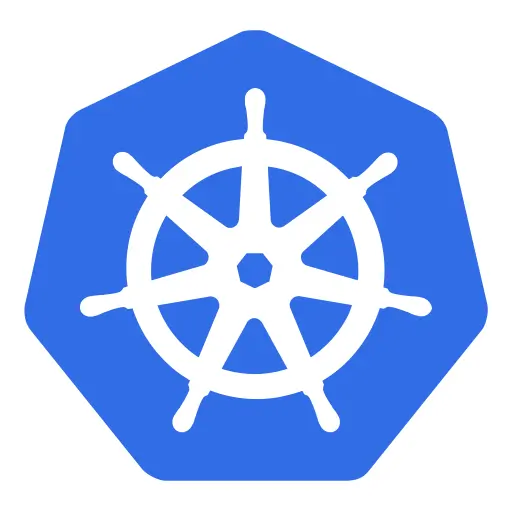

# Fundamentos de Kubernetes & Openshift para developers


## Preliminar

### Preparacion de entorno


<p>

```bash
crc stop
```
```bash
crc start --disk-size 250
```

Al terminar el arranque, nos conectamos al cluster:

```bash
oc login -u kubeadmin https://api.crc.testing:6443
```

Abrimos la consola de CRC, entrando en el sigiente enlace:

<a href="https://console-openshift-console.apps-crc.testing" target="_blank">Link to web console</a>

Nos logueamos con el usuario kubeadmin, y el password que encontraremos en los logs de arranque.


A continuación lanzamos el siguiente comando:

```bash
oc adm policy add-scc-to-user anyuid -z default 
```
</p>


## Introducción

### Paseo por consola 

<p>
<a href="https://oauth-openshift.apps.cluster0017.non-prod.ichp.ing.net/oauth/authorize?client_id=console&redirect_uri=https%3A%2F%2Fconsole-openshift-console.apps.cluster0017.non-prod.ichp.ing.net%2Fauth%2Fcallback&response_type=code&scope=user%3Afull&state=d95b0528" target="_blank">Consola ICHP</a>
</p>


## PODs

### Creamos un nuevo POD de forma imperativa

<p>

```bash
oc run first-app-pod --image public.ecr.aws/nginx/nginx:alpine-slim
```

</p>


### Lo observamos y lo borramos el POD

<p>


```bash
oc get pods 
```
```bash
oc get pod first-app-pod -o yaml 
```
```bash
oc get pods first-app-pod -o wide 
```
```bash
oc describe pod first-app-pod
```
```bash
oc delete pod first-app-pod
```

</p>


### Creamos un nuevo POD de forma declarativa

<p>

```bash
cat manifest/pod.yaml
```
```yaml
apiVersion: v1
kind: Pod
metadata:
  name: my-app-pod
  labels:
    app: my-app
    type: frontend
spec:
  containers:
  - name: nginx-container
    image: public.ecr.aws/nginx/nginx:alpine-slim
```
```bash
oc create -f manifest/pod.yaml
```
```bash
oc get pods 
```
</p>

### Creamos nuevo POD multicontainer de forma declarativa

<p>

```bash
cat manifest/multi-pod.yaml
```

```yaml
apiVersion: v1
kind: Pod
metadata:
  name: my-multi-app-pod
  labels:
    app: my-multi-app
    type:  frontend
spec:
  containers:
    - name: nginx-container
      image: public.ecr.aws/nginx/nginx:alpine-slim
    - name: ubuntu
      image: ubuntu:latest
      command: [ "/bin/bash", "-c", "--" ]
      args: [ "while true; do sleep 30; done;" ]
```

```bash
oc create -f manifest/pod-multi-container.yaml
```
</p>


### observamos los PODs

<p>

```bash
oc get pods 
```
```bash
oc get pod my-app-pod -o wide 
```
```bash
oc get pod my-multi-app-pod -o yaml 
```
</p>


## Deployments

### Podemos crear un nuevo deployment de forma imperativa

<p>

```bash
oc create deployment my-imperative-dep --image=public.ecr.aws/nginx/nginx:alpine-slim --replicas=3
```
</p>


### Lo observamos y lo borramos el deployment

<p>

```bash
oc get deployments 
```

```bash
oc get pods
```
```bash
oc delete deployment my-imperative-dep
```
```bash
oc get pods
```
</p>


### Creamos un nuevo Deployment de forma declarativa

<p>

```bash
cat manifest/deployment.yaml
```

```yaml
apiVersion: apps/v1
kind: Deployment
metadata:
  name: my-app-deployment
  labels:
    app: my-app
    type: frontend
spec:
  replicas: 3
  selector:
    matchLabels:
      app: my-app
  template:
    metadata:
      labels:
        app: my-app
    spec:
      containers:
      - name: nginx-container
        image: public.ecr.aws/nginx/nginx:alpine-slim
        env:
         - name: VERSION
           value: "DEPLOYMENT 1"
  strategy:
    type: RollingUpdate
    rollingUpdate:
      maxUnavailable: 1
      maxSurge: 2
```

```bash
oc apply -f manifest/deployment.yaml
```

</p>


### Observamos el nuevo deployment

<p>

```bash
oc get deployments
```
```bash
oc get replicaset
```
```bash
oc get pods
```
```bash
oc rollout status deployment/my-app-deployment
```
```bash
oc rollout history deployment/my-app-deployment
```

```bash
cat manifest/deployment-update.yaml
```

```yaml
kind: Deployment
metadata:
  name: my-app-deployment
  labels:
    app: my-app
    type: frontend
spec:
  replicas: 3
  selector:
    matchLabels:
      app: my-app
  template:
    metadata:
      labels:
        app: my-app
    spec:
      containers:
        - name: nginx-container
          image: public.ecr.aws/nginx/nginx:alpine-slim
          env:
            - name: VERSION
              value: "DEPLOYMENT 2"
  strategy:
    type: RollingUpdate
    rollingUpdate:
      maxUnavailable: 1
      maxSurge: 2
 ```

```bash
oc apply -f manifest/deployment-update.yaml
```
```bash
oc rollout status deployment/my-app-deployment
```
```bash
oc rollout history deployment/my-app-deployment
```
```bash
oc get deployment my-app-deployment -o yaml
```
```bash
oc rollout undo deployment/my-app-deployment
```
```bash
oc rollout status deployment/my-app-deployment
```
```bash
oc rollout history deployment/my-app-deployment
```
```bash
oc get deployment my-app-deployment -o yaml
```

</p>


## Namespaces
### Podemos crear un nuevo namespace de forma imperativa

<p>

```bash
oc create namespace my-imp-namespace
```
</p>


### Podemos crear un nuevo namespace de forma declarativa

<p>

```bash
cat manifest/namespace.yaml
```

```yaml
apiVersion: v1
kind: Namespace
metadata:
  name: my-namespace
```

```bash
oc apply -f manifest/namespace.yaml 
```
</p>


### Lo observamos

<p>

```bash
oc get namespaces
```
```bash
oc get pods --all-namespaces
```
```bash
oc get deployments --all-namespaces
```
</p>


### Creamos un nuevo POD en el nuevo namespace 

<p>

```bash
oc run namespaced-pod --image public.ecr.aws/nginx/nginx:alpine-slim -n my-namespace
```

</p>


### Observamos el nuevo pod

<p>

```bash
oc get pods --namespace=my-namespace
```

</p>


## Job, Cronjobs, Daemonsets y Statefulset

### Los observamos en la consola de ICHP

<p>

<a href="https://oauth-openshift.apps.cluster0017.non-prod.ichp.ing.net/oauth/authorize?client_id=console&redirect_uri=https%3A%2F%2Fconsole-openshift-console.apps.cluster0017.non-prod.ichp.ing.net%2Fauth%2Fcallback&response_type=code&scope=user%3Afull&state=d95b0528" target="_blank">Consola ICHP</a>
</p>


## ResourceQuota

### Observamos en la consola de ICHP los ResourceQuotas de recursos y objetos en projecto ICHP real

<p>

<a href="https://oauth-openshift.apps.cluster0017.non-prod.ichp.ing.net/oauth/authorize?client_id=console&redirect_uri=https%3A%2F%2Fconsole-openshift-console.apps.cluster0017.non-prod.ichp.ing.net%2Fauth%2Fcallback&response_type=code&scope=user%3Afull&state=d95b0528" target="_blank">Consola ICHP</a>
</p>


## ConfigMaps
### Podemos crear un nuevo ConfigMap de forma imperativa

<p>

```bash
oc create configmap my-imp-app-config1 --from-literal=APP_COLOR=blue --from-literal=APP_MODE=dev
```
```bash
oc create configmap my-imp-app-config2 --from-file=properties/config.properties  
```
</p>


### Podemos crear un nuevo ConfigMap de forma declarativa

<p>

```bash
cat manifest/config-map.yaml
```

```yaml
apiVersion: v1
kind: ConfigMap
metadata:
  name: my-app-config
data:
  APP_COLOR: blue
  APP_MODE: dev
```

```bash
oc apply -f manifest/config-map.yaml 
```
</p>


### Lo observamos

<p>

```bash
oc get configmaps
```
```bash
oc get configmap my-app-config -o yaml
```
```bash
oc describe configmap my-app-config
```
</p>


## Secrets
### Podemos crear un nuevo Secret de forma imperativa

<p>

```bash
oc create secret generic my-app-secret1 --from-literal=DB_USER=user --from-literal=DB_PASSWORD=mypassword
```
```bash
oc create secret generic my-app-secret2 --from-file=properties/secrets.properties 
```

</p>


### Podemos crear un nuevo Secret de forma declarativa

<p>

```bash
cat manifest/secret.yaml
```

```yaml
apiVersion: v1
kind: Secret
metadata:
  name: my-app-secret
data:
  DB_PASSWORD: bXlwYXNzd29yZA==
  DB_USER: dXNlcg==
```

```bash
oc apply -f manifest/secret.yaml 
```
</p>


### Lo observamos

<p>

```bash
oc get secrets
```
```bash
oc get secrets my-app-secret -o yaml
```
```bash
oc describe secrets my-app-secret
```
</p>


## Service Accounts
### Creamos un service account

<p>

```bash
oc create serviceaccount my-service-account
```
</p>


### Observamos el service account y el secreto asociado donde se almacena el token

<p>

```bash
oc get serviceaccount my-service-account
```
```bash
oc describe serviceaccount my-service-account
```
```bash
oc get secrets
```

</p>


### Observamos en la consola de ICHP los service account y secret prom-tenancy-access y prom-tenancy-access-token

<p>

<a href="https://oauth-openshift.apps.cluster0017.non-prod.ichp.ing.net/oauth/authorize?client_id=console&redirect_uri=https%3A%2F%2Fconsole-openshift-console.apps.cluster0017.non-prod.ichp.ing.net%2Fauth%2Fcallback&response_type=code&scope=user%3Afull&state=d95b0528" target="_blank">Consola ICHP</a>
</p>


## Resource requirements.
### Mostramos los resource requirements en un POD de ICHP 


<p>

<a href="https://oauth-openshift.apps.cluster0017.non-prod.ichp.ing.net/oauth/authorize?client_id=console&redirect_uri=https%3A%2F%2Fconsole-openshift-console.apps.cluster0017.non-prod.ichp.ing.net%2Fauth%2Fcallback&response_type=code&scope=user%3Afull&state=d95b0528" target="_blank">Consola ICHP</a>
</p>


## Taints and Tolerations, Node affinity and PodAntiaffinity

### Observamos en la consola de ICHP en la defición de POD de un Merak real

<p>
<a href="https://oauth-openshift.apps.cluster0017.non-prod.ichp.ing.net/oauth/authorize?client_id=console&redirect_uri=https%3A%2F%2Fconsole-openshift-console.apps.cluster0017.non-prod.ichp.ing.net%2Fauth%2Fcallback&response_type=code&scope=user%3Afull&state=d95b0528" target="_blank">Consola ICHP</a>
</p>


## Readiness & Liveness probes

### Observamos en la consola de ICHP en la defición de POD de un Merak real

<p>
<a href="https://oauth-openshift.apps.cluster0017.non-prod.ichp.ing.net/oauth/authorize?client_id=console&redirect_uri=https%3A%2F%2Fconsole-openshift-console.apps.cluster0017.non-prod.ichp.ing.net%2Fauth%2Fcallback&response_type=code&scope=user%3Afull&state=d95b0528" target="_blank">Consola ICHP</a>
</p>


## Events
### Podemos observar los eventos en la consola de ICHP de un Merak real

<p>
<a href="https://oauth-openshift.apps.cluster0017.non-prod.ichp.ing.net/oauth/authorize?client_id=console&redirect_uri=https%3A%2F%2Fconsole-openshift-console.apps.cluster0017.non-prod.ichp.ing.net%2Fauth%2Fcallback&response_type=code&scope=user%3Afull&state=d95b0528" target="_blank">Consola ICHP</a>
</p>


### Podemos ver los eventos de un determinado objeto con get events o describe

<p>

```bash
oc get events 
```
```bash
oc describe pod my-app-pod 
```
```bash
oc get events --namespace my-namespace
```
```bash
oc get events --sort-by=.metadata.creationTimestamp
```
```bash
oc get event --field-selector type=Warning
```

</p>


## Container Logging
### Podemos observar los logs en la consola de ICHP en la defición de POD de un Merak real

<p>

<a href="https://oauth-openshift.apps.cluster0017.non-prod.ichp.ing.net/oauth/authorize?client_id=console&redirect_uri=https%3A%2F%2Fconsole-openshift-console.apps.cluster0017.non-prod.ichp.ing.net%2Fauth%2Fcallback&response_type=code&scope=user%3Afull&state=d95b0528" target="_blank">Consola ICHP</a>
</p>


### Podemos ver los logs de un determinado POD mono-container con get events o describe

<p>

```bash
oc logs --follow my-app-pod
```
</p>


### Podemos ver los logs de un determinado POD multi-container especificando el container

<p>

```bash
oc logs --follow my-multi-app-pod nginx-container
```
</p>


## Services
### Observamos los servicios existentes

<p>

```bash
oc get services
```
</p>


### Creamos un nuevo clusterIP y exponemos nuestro desployment en él

<p>

```bash
oc expose deployment my-app-deployment --name=my-app-svc-clusterip --port=80 --target-port=8080
```
```bash
oc get services
```

</p>


### Observamos el clusterIP de nuestro Merak en la consola de Openshift

<p>
<a href="https://oauth-openshift.apps.cluster0017.non-prod.ichp.ing.net/oauth/authorize?client_id=console&redirect_uri=https%3A%2F%2Fconsole-openshift-console.apps.cluster0017.non-prod.ichp.ing.net%2Fauth%2Fcallback&response_type=code&scope=user%3Afull&state=d95b0528" target="_blank">Consola ICHP</a>
</p>


### Creamos un nuevo NodePort y exponemos nuestro desployment 

<p>

```bash
cat manifest/node-port.yaml 
```

```yaml
apiVersion: v1
kind: Service
metadata:
  name: my-node-port-service
  labels:
    app: my-node-port-service
spec:
  type: NodePort
  selector:
    app: my-app
  ports:
    - protocol: TCP
      port: 80
      targetPort: 8080
      NodePort: 30080
```

```bash
oc apply -f manifest/node-port.yaml 
```
```bash
oc expose deployment my-app-deployment --name=my-app-svc-node-port --port=80 --target-port=8080 --type=NodePort 
```
</p>


### Creamos un nuevo Load Balancer

<p>

```bash
oc expose deployment my-app-deployment --name=my-app-svc-loadbalancer --port=80 --target-port=8080 --type=LoadBalancer 
```
```bash
oc get services
```
</p>


## Network Policies

### Observamos la network Policy allow-touchpoint-mesh-traffic en consola de Openshift

<p>
<a href="https://oauth-openshift.apps.cluster0017.non-prod.ichp.ing.net/oauth/authorize?client_id=console&redirect_uri=https%3A%2F%2Fconsole-openshift-console.apps.cluster0017.non-prod.ichp.ing.net%2Fauth%2Fcallback&response_type=code&scope=user%3Afull&state=d95b0528" target="_blank">Consola ICHP</a>
</p>


## Access Control & RBAC Authorization

### Observamos el rol prom-tenancy-access en consola de Openshift

<p>
<a href="https://oauth-openshift.apps.cluster0017.non-prod.ichp.ing.net/oauth/authorize?client_id=console&redirect_uri=https%3A%2F%2Fconsole-openshift-console.apps.cluster0017.non-prod.ichp.ing.net%2Fauth%2Fcallback&response_type=code&scope=user%3Afull&state=d95b0528" target="_blank">Consola ICHP</a>
</p>


## APIGroups

### Observamos los api groups en la consola de Openshift

<p>
<a href="https://oauth-openshift.apps.cluster0017.non-prod.ichp.ing.net/oauth/authorize?client_id=console&redirect_uri=https%3A%2F%2Fconsole-openshift-console.apps.cluster0017.non-prod.ichp.ing.net%2Fauth%2Fcallback&response_type=code&scope=user%3Afull&state=d95b0528" target="_blank">Consola ICHP</a>
</p>


## Custom Resource Definitions

### Observamos los api groups en la consola de Openshift

<p>
<a href="https://oauth-openshift.apps.cluster0017.non-prod.ichp.ing.net/oauth/authorize?client_id=console&redirect_uri=https%3A%2F%2Fconsole-openshift-console.apps.cluster0017.non-prod.ichp.ing.net%2Fauth%2Fcallback&response_type=code&scope=user%3Afull&state=d95b0528" target="_blank">Consola ICHP</a>
</p>


## Projects
### Creamos un nuevo Projects de forma imperativa

<p>

```bash
oc new-project workshop
```
```bash
oc project workshop
```
```bash
oc describe project workshop
```

```bash
oc get projects
```
</p>


## Routes
### Creamos una nueva Route

<p>

```bash
oc project default
```

```bash
oc expose svc my-app-svc-clusterip
```
```bash
oc get routes
```

</p>

